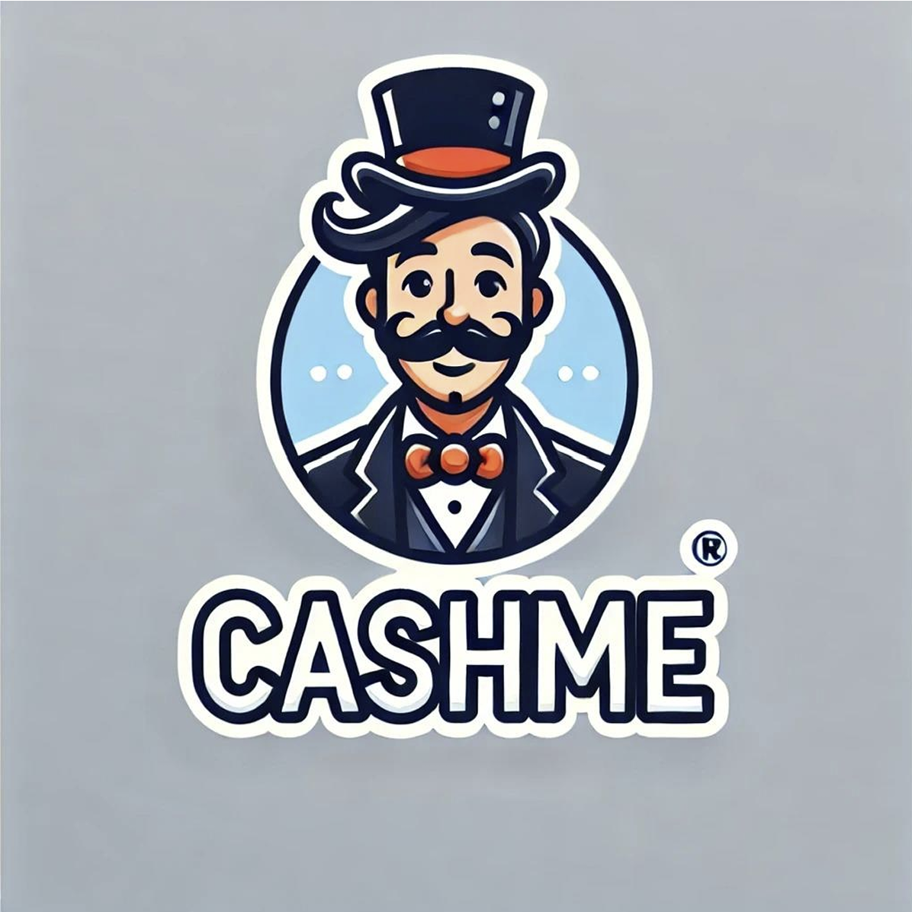

# Cashme



Cashme es una aplicación desarrollada con Node.js y Express para gestionar finanzas personales o empresariales de manera sencilla y eficiente. La aplicación permite registrar, categorizar y visualizar transacciones financieras, además de ofrecer herramientas adicionales como gráficos y un chat para analizar el mercado bursátil.

## Características principales

- **Gestión de ingresos y gastos:** Registra transacciones financieras con detalles como descripción, monto y categoría.
- **Gráficas interactivas:** Visualiza ingresos, gastos y utilidades netas de manera clara.
- **Chat financiero:** Consulta información en tiempo real sobre el mercado bursátil.
- **Blog de finanzas:** Descubre consejos y artículos relacionados con la administración del dinero.

## Tecnologías utilizadas


## Instalación

1. Clona el repositorio:

   ```bash
   git clone https://github.com/tu_usuario/cashme.git
   cd cashme
   ```

2. Instala las dependencias:

   ```bash
   npm install
   ```

3. Inicia la aplicación:

   ```bash
   npm start
   ```

   La aplicación estará disponible en `http://localhost:3000`.

## Funcionalidades destacadas

- **Gráficas:** Muestra estadísticas detalladas de ingresos, gastos y utilidades.
- **Chat en entre usuarios:** Comunicate con tu circulo dentro del mundo de las finanzas
- **Blog de finanzas:** Explora artículos relevantes y aprende sobre finanzas personales.

## Contribuciones

¡Las contribuciones son bienvenidas! Si deseas colaborar, por favor abre un _issue_ o envía un _pull request_.

## Licencia

Este proyecto está licenciado bajo la Licencia MIT. Consulta el archivo `LICENSE` para más detalles.

---

¡Gracias por usar Cashme! 🎉


### Equipo:


- **Carlos Moragón** [@carlosMoragon](https://github.com/carlosMoragon)👩🏼‍💻| [LinkedIn](https://www.linkedin.com/in/carlos-morag%C3%B3n-corella/)
- **Daniel Fernández López** [@DaniFL](https://github.com/DaniFL)🚀| [LinkedIn](https://www.linkedin.com/in/danielfernandezlopezprofile/)
- **Paloma Pérez de Madrid** [@PPerezdeMadrid](https://github.com/PPerezdeMadrid)🎨| [LinkedIn](https://www.linkedin.com/in/palomaperezdemadrid/)
- **Javier Martínez Cristóbal** [@Jmartinezc-rgb](https://github.com/Jmartinezc-rgb)🌐| [LinkedIn](https://www.linkedin.com/in/javier-martinez-cristobal/)
- **Orianna Milone** [@OriannaMilone](https://github.com/OriannaMilone)🔍| [LinkedIn](https://www.linkedin.com/in/orianna-milone-salas-364832220/)
- **Ángel Castillo** [@AngelCastillo67](https://github.com/AngelCastillo67)👾| [LinkedIn](https://www.linkedin.com/in/%C3%A1ngel-castillo-ortega-788577250/)
